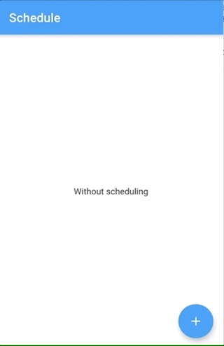

# Schedule App

A Flutter app where users can register their schedules when they are completed.

It was used flutter with reactive programming using BLOC pattern, sqlite was used to store local data. The instructions to run is bellow.

## Getting Started

To run functional tests:

`pre`flutter drive --target=test_driver/app.dart`

To run unit tests:

`flutter test`

To generate android apk

`flutter build apk`

To generate iOS apk

`flutter build ios`

To install: First you nedd to get your device id with

`flutter devices`

Now, to install

`flutter install -d <deviceId>`

